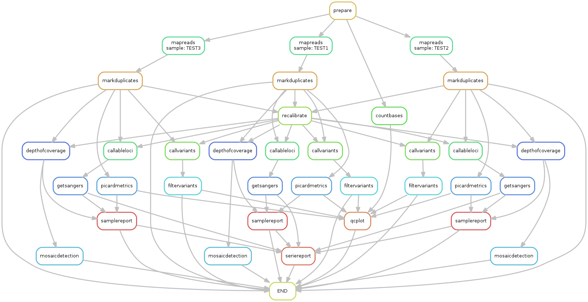

[](https://snakemake.readthedocs.io/en/latest/)

# NGS workflow

De AMC-pipeline is een [snakemake](http://snakemake.readthedocs.io/en/stable/)
workflow.  Snakemake is een workflow management systeem dat gebruik maakt van
door de gebruiker beschreven regels. Deze regels definieren hoe van bepaalde
input files (bijvoorbeeld fastq's) output files te maken (bam, vcf etc.).

Hieronder staat de code voor de regel die gebruikt wordt om reads te alignen
en te sorteren in een BAM file.  

```python
rule mapreads:
    input:
        "reads/{sample}.R1.fastq.gz",
        "reads/{sample}.R2.fastq.gz"
    output:
        "alignments/{sample}.sorted.bam"
    params:
        rg = "@RG\\tID:{sample}\\tLB:{sample}\\tPL:ILLUMINA\\tPU:{sample}\\tSM:{sample}"
    shell:
        '''(bwa mem  -R '{params.rg}' -t 1 -M {REF} {input} |\
        samtools view -Shu - |\
        samtools sort -T {wildcards.sample}.tmp -O bam - > {output}) 2> {log}
        '''
```

Een regel heeft input, output en een methode om output van input te maken. In
de weergegeven regel is die methode  een shell commando waarin o.a.
BWA wordt gebruikt.  In plaats van voor elk sample de exacte filenamen van de
in- en output files op te geven wordt er gebruik gemaakt van wildcards.
In dit voorbeeld is de gebruikte wildcard `{sample}` zodat snakemake voor elk
sample met de R1 en R2 fastq een gesorteerde BAM maakt. Deze dient als input
voor de volgende regel: het markeren van de duplicate reads. De output kan als
temp-file worden aangemerkt en dat betekent dat snakemake het bestand verwijdert
wanneer het niet meer nodig is in de pipeline.

Na het opstellen van de regels wordt aangegeven wat de
gewenste outputfiles zijn. In de AMC-pipeline zijn dit sowieso per patient een
BAM, een vcf en excel en per serie een PDF en excel. Snakemake
bekijkt welke regels deze files als output beschrijven en zoekt dan naar de
files die nodig zijn als input voor de gevonden regel(s). Indien deze files nog niet
bestaan zoekt snakemake een regel met (een van deze) files als output. Dit gaat
zo door totdat snakemake een regel vindt waarvoor de inputfiles aanwezig zijn
en vanaf die regel gaat de workflow van start.


